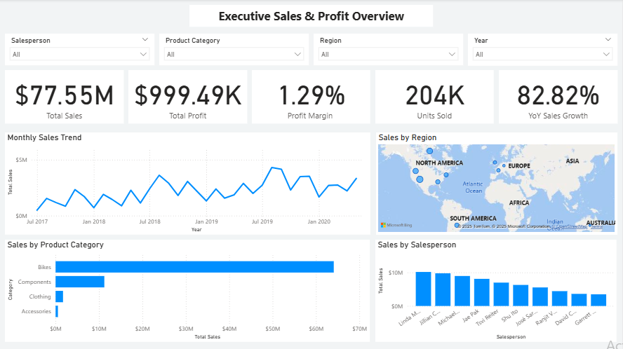
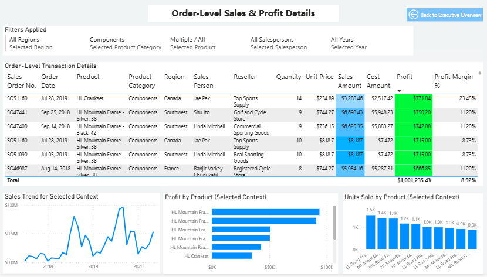
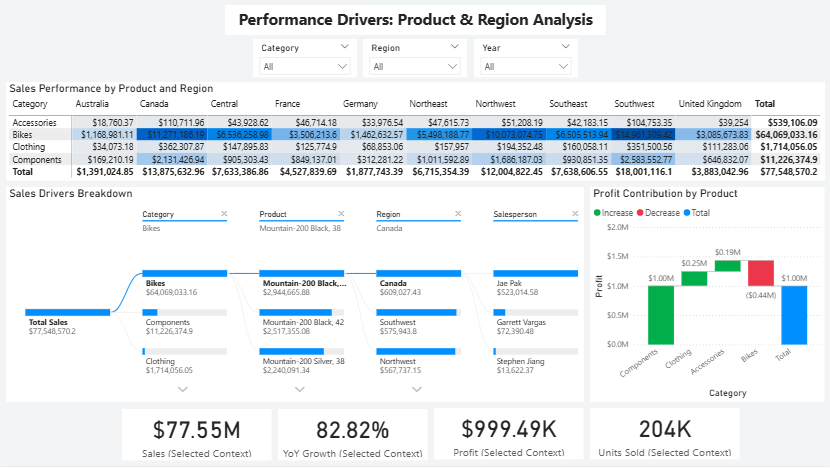

# Sales Performance & Growth Analysis (Power BI)

## Project Overview
This project demonstrates an end-to-end Business Intelligence solution built in Power BI, focusing on sales performance, profitability, and growth drivers.

The dashboard is designed for business stakeholders to quickly understand performance trends, identify key contributors, and drill down into transactional details.

## 🔗 Live Interactive Dashboard

👉 **View Live Power BI Report (Web Version)**  
[https://bdcerts.com/projects/sales-performance](https://bdcerts.com/projects/sales-performance)

This page includes:
- Embedded interactive Power BI dashboard
- Executive overview and drillthrough pages
- Optimized viewing for desktop and tablet

> Note: Power BI Public link is embedded on the project page for seamless viewing.

## Key Highlights
- Total Sales, Profit, Units Sold, and YoY Growth KPIs
- Multi-page report with executive overview and deep-dive analysis
- Drillthrough from summary visuals to order-level transactions
- Decomposition tree and waterfall analysis for performance drivers
- Clean star-schema data model with time intelligence

## Pages Included
### 1. Executive Overview
- High-level KPIs for Sales, Profit, Units Sold, and YoY Growth
- Sales trends over time
- Performance breakdown by product category and region
- Interactive filters for year, product, and region

### 2. Order-Level Drillthrough Analysis
- Drillthrough from summary visuals to detailed transactions
- Order date, product, region, salesperson, sales, cost, and profit
- Context-aware filtering for selected year and dimensions

### 3. Performance Drivers: Product & Region Analysis
- Heatmap showing sales performance across products and regions
- Decomposition tree to identify key sales drivers
- Waterfall chart illustrating profit contribution by product
- KPIs dynamically responding to selected context

## Business Questions Answered
- Which products and regions drive overall sales and profit?
- What factors contribute most to sales growth or decline?
- How do individual products and regions impact profitability?
- How can stakeholders drill from summary to transaction-level insights?

## Data Modeling & DAX
- Star schema with fact and dimension tables
- Dedicated Date dimension with time intelligence
- Measures for total sales, profit, units sold, and YoY growth
- Drillthrough and filter context handled correctly

## Tools & Skills Demonstrated
- Power BI
- DAX (time intelligence, aggregation, context handling)
- Data modeling (fact/dimension design)
- Dashboard design & UX best practices
- Business-focused analytical storytelling

## Screenshots
Screenshots of all pages are included in the `screenshots` folder for quick review.

## 🔁 Direct Power BI Access (Optional)
If you prefer to open the report directly in Power BI Service:

🔗 https://app.powerbi.com/view?r=eyJrIjoiYWY5MGUzNWQtMWQ0Mi00ODY2LWI3YjAtMjFiYmEyMzQ4ODRhIiwidCI6IjJhMGRlOTE5LTRmNzUtNDhiYy1hMDJhLWUwMzRhMmM1MDgyMSIsImMiOjh9&pageName=2bc01b65d8eaacd153a4

## PBIX File Access
The PBIX file is available upon request for hiring managers or reviewers.

## Author
Amin  
Helsinki, Finland  
📧 amin@bdcerts.com 

